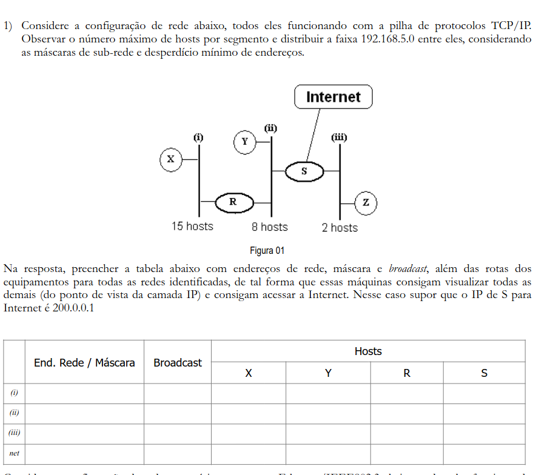
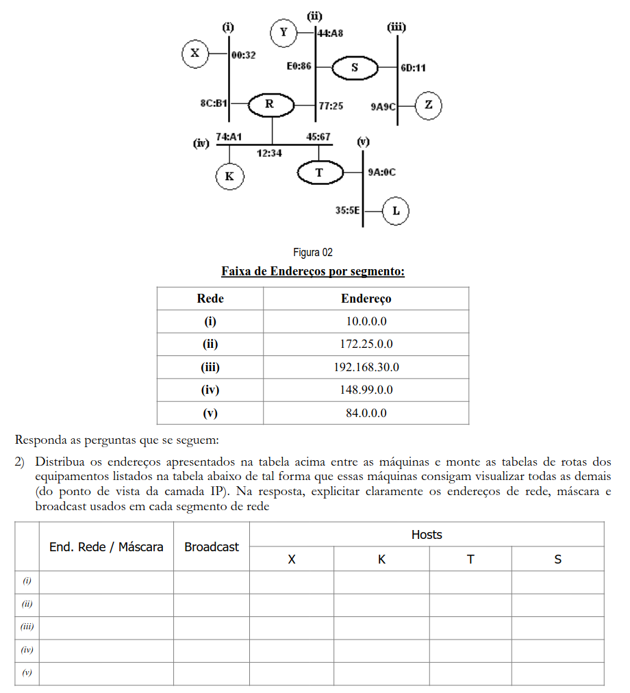

# Resumo para prova de Redes dia 7 de Maio de 2023

## Camada de Redes 

1. Endereços IP

No contexto de Camada de Redes o IP serve para identificar um host ou um roteador. Teoricamente esse valor deveria ser único, não podendo haver mais de uma máquina com o mesmo endereço IP, além disso todos endereços IPs devem ter 32bits. Porém para evitar o esgotamento de enderços IPs dentro de uma rede (que possui um endereço IP único), é feito uma repetição de IPs dentro da rede, o que isso quer dizer? Quer dizer que dentro da sua rede de casa cada máquina conectada possui um endereço único, mas esse endereço pode ser repetido em outra rede.

**Importante lembrar que o endereço IP se refere não ao host, mas sim a interface de rede da máquina.**

1.1. Endereçamento de classe

Durante muito tempo foi usado categorias para poder alocar os tipos de rede possíveis, sendo definido cinco categorias. Esse tipo de alocação foi chamado de **Endereçamento de classe completo**. Nele são definidas as seguintes classes:

- Classe A:
    - Definida pelos endereços de 1.0.0.0 até 127.255.255.255.
- Classe B:
    - Definida pelos endereços de 128.0.0.0 até 191.255.255.255.
- Classe C:
    - Definida pelos endereços de 192.0.0.0 até 223.255.255.255.
- Classe D:
    - Definida pelos endereços de 224.0.0.0 até 239.255.255.255.
- Classe E:
    - Definida pelos endereços de 240.0.0.0 até 247.255.255.255.

**Importante notar que as classe vai possuir 32bits, ou seja 4 bytes. Que em notação decimal pode ser escrito indo de 0 a 255, como demonstrado acima.**

O endereço IP 0.0.0.0 é utilizado pelos hosts ao serem inicializados, além disso o a faixa de endereço: 127.x.x.x, é utilizada como loopcallback. Loopcallback é utilizado para processar localmente os pacotes sem ser necessário que o transmissor saiba o IP do host local.

1.2 Sub-redes

* Exercícios:

### Exercício 1

No enunciado do exercício é definido que a faixa do IP que será distribuida será 192.168.5.0, portanto o primeiro passo será determinar a mascará de rede utilizada. Primeiramente precisamos definir o número de subredes e quantos host teremos no máximo em cada.
Teremos ao todo 3 subredes com 15, 8 e 2 host, porém não podemos ter uma rede que permita 16 host (o número máximo de host de uma rede é determinado pela quantidade de 0 na máscara de rede) tendo 15 host, pois o primeiro e o último valor dessa rede será destinado ao network address e ao broadcast respectivamente. Logo, vamos determinar a máscara de rede para cada subrede:

- I: 
    Como não podemos ter o máximo de 16 host, pois a rede tem 15 hosts, vamos ter que definir uma máscara que comporte 32 hosts. Logo, quer dizer que a máscara terá 24 bits (determinado pela classe da faixa de IP) mais 3 bits, pois 1 bit a mais vale 128, 2 bits 64 e 3 bits 32: 11111111.11111111.11111111.11100000. Isso equivale a 255.255.255.224(128+64+32). 
    - Assim, o endereço de rede e o endereço de broadcast serão:
        - 192.168.5.0/27 e 192.168.5.31/27 
    
- II: 
    Seguindo a mesma linha de raciocínio da subrede anterior, teremos que definir uma subrede com 16 host no máximo. Para isso teremos uma máscara de rede com 28 bits, o que da 11111111.11111111.11111.11110000. Em decimal esse valor é igual a 255.255.255.240.
    - Assim, o endereço de rede e o endereço de broadcast serão:
        - 192.168.5.32/28 e 192.168.5.47/27 
    
- III: 
    E por fim temos a subrede três que consegue suportar 2 host com 30 bits 11111111.11111111.11111.11111100 que equivale a 255.255.255.252
    - Assim, o endereço de rede e o endereço de broadcast serão:
        - 192.168.5.48/30 e 192.168.5.52/30 
    
- NET:
    Já a rede de internet será definida com 0.0.0.0, esse IP é usado para se referir a rede atual.

### Exercicio 2

Considerando as informações fornecidas sobre os IPs de cada rede, devemos definir suas classes para conseguir cada máscara de rede:

- I:
    como esse endereço está abaixo de 128.0.0.0 será de classe A. Logo, terá máscara 255.0.0.0.
- II:
    como esse endereço está abaixo de 192.0.0.0 e acima de 128.0.0.0 será de classe B. Logo, terá máscara 255.255.0.0.
- III:
    como esse endereço está abaixo de 224.0.0.0 e acima de 192.0.0.0 será de classe C. Logo, terá máscara 255.255.255.0.
- IV:
    como esse endereço está abaixo de 192.0.0.0 e acima de 128.0.0.0 será de classe B. Logo, terá máscara 255.255.0.0.
- V:
    como esse endereço está abaixo de 128.0.0.0 será de classe A. Logo, terá máscar 255.0.0.0.

Agora que isso foi definido vamos montar a máscara de rede começando pela rede I: 

* I:
   A rede I possui 2 host (X e R), portanto devemos definir uma máscara de rede para 4 host por causa do IP de broadcast e o de endereço de rede.
   Isso faz com que tenhamos 30 bits na máscara de rede, o que em decimal seria 255.255.255.252. Portanto nosso endereço de rede e broadcast serão:
   
   - 10.0.0.0/30 e 10.0.0.3/30

* II:
   A rede II possui 3 host (R, Y e S), portanto devemos definir 8 host, pois contando com o IP de broadcast e endereço de rede essa rede irá conter 5 host. Para conseguir comportar todos esses hosts iremos ter que usar um máscara de rede com no máximo 8 host.  
   Isso faz com que tenhamos 29 bits na máscara de rede, o que em decimal seria 255.255.255.248. Portanto nosso endereço de rede e broadcast serão:
   
   - 172.25.0.0/29 e 172.25.0.7/29

* III:
   A rede III possui 2 host (S e Z), portanto devemos definir 4 host.
   Isso faz com que tenhamos 30 bits na máscara de rede, o que em decimal seria 255.255.255.252. Portanto nosso endereço de rede e broadcast serão:
   
   - 192.168.30.0/30 e 192.168.30.3/30

* IV:
   A rede IV possui 3 host (K, R e T), portanto devemos definir 8 host.
   Isso faz com que tenhamos 29 bits na máscara de rede, o que em decimal seria 255.255.255.248. Portanto nosso endereço de rede e broadcast serão:
   
   - 148.99.0.0/29 e 148.99.0.7/29

* V:
   A rede V possui 2 host (L e T), portanto devemos definir 4 host.
   Isso faz com que tenhamos 30 bits na máscara de rede, o que em decimal seria 255.255.255.252. Portanto nosso endereço de rede e broadcast serão:
   
   - 84.0.0.0/30 e 82.0.0.3/30
   
Agora que definimos os endereços de rede e de broadcast podemos atribuir o endereço IP para cada máquina nos segmentos de rede. Para facilitar esse descrição no documento irei apenas indicar o endereço IP que cada subrede usará para se comunicar com X, K, T e S (sempre nessa ordem): 

* I: 
    10.0.0.1, 148.99.0.2, 148.99.0.2, 172.25.0.1.

* II: 
    10.0.0.2, 148.99.0.2, 148.99.0.2, 172.25.0.2.

* III: 
    10.0.0.2, 148.99.0.2, 148.99.0.2, 192.168.30.1. 

* IV: 
    10.0.0.2, 148.99.0.1, 148.99.0.3, 172.25.0.1. 

* V: 
    10.0.0.2, 148.99.0.3, 84.0.0.1, 172.25.0.1. 
